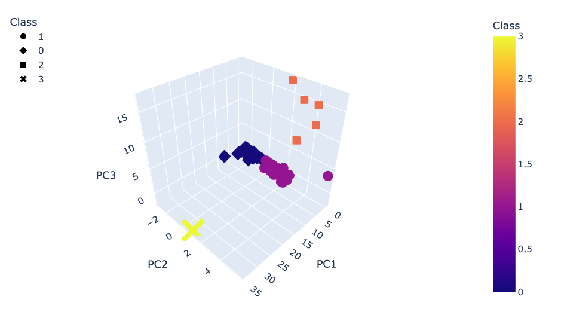

# Cryptocurrencies
BC Mod 18

## Overview
The purpose of this analysis is to assess various Cryptocurrencies by means of Unsupervised Machine Learning in order to discover unknown patterns in the dataset. Much of this effort went into preproccesing the dataset for analysis. The algorithms and techniques emphasized here were clustering, K-means, and Principal Component Analysis.  

### Resources
* Machine Learning Dev Environment
* Jupyter Notebook 6.4.6
* Python 3.7.11

Python Dependencies:
* pandas
* hvplot.pandas
* Path from path
* plotly.express
* StandardScaler and MinMaxScaler from sklearn.preproccesing
* PCA from sklearn.decomposition
* KMeans from sklearn.cluster

## Results
After loading the data, preproccesing included retaining only cryptocurrencies that are actively trading, have mined more than zero coins, and those that have data for all features.  

Initial Dataframe Head  
  

Subsequently, the data was scaled, fit, and transformed in preparation for a Principal Component Analysis (PCA).  
  

  

Using an elbow curve, a K value of 4 was deemed best.  
  

A dataframe was constructed using the dataframe above plus the results from the PCA and the k-means analysis, which divided the data into classes.  
   

In order to visualize the clusters, a 3D graph was plotted.  
  

Finally, after some additional transformation, a 2d scatter plot was generated for Total Coins Mined v Total Coin Supply.  
  

## Summary
Through the extensive analysis detailed above, Bitcoin is clearly an outlier in this dataset.  
